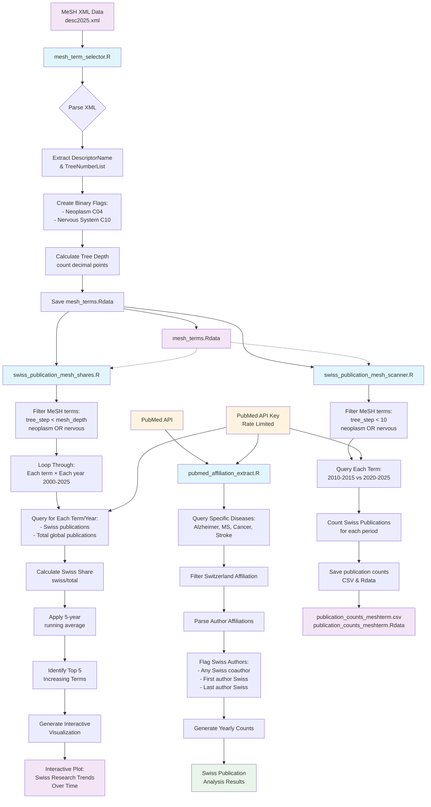

# R Scripts Process Flow Chart

- View flowchart: go to https://mermaid.live and paste mermaid code below:

## Key Process Components:

### 1. **Data Preparation Phase** (`mesh_term_selector.R`)
- **Input**: MeSH XML descriptor file
- **Process**: Parse → Extract → Categorize → Calculate hierarchy
- **Output**: Structured MeSH term database

### 2. **Swiss Research Analysis** (`pubmed_affiliation_extract.R`)
- **Input**: PubMed API + specific disease queries
- **Process**: Query → Filter affiliations → Parse authors → Flag Swiss involvement
- **Output**: Swiss authorship patterns by year

### 3. **Comparative Time Analysis** (`swiss_publication_mesh_scanner.R`)
- **Dependencies**: Uses MeSH terms from Script 1
- **Process**: Filter terms → Query two time periods → Count publications
- **Output**: Before/after comparison data

### 4. **Global Share Tracking** (`swiss_publication_mesh_shares.R`)
- **Dependencies**: Uses MeSH terms from Script 1
- **Process**: Year-by-year queries → Calculate shares → Smooth trends → Visualize
- **Output**: Interactive trend visualization

## Critical Dependencies:
- **Sequential Dependency**: Script 1 must run first (creates MeSH term database)
- **API Dependency**: Scripts 2-4 depend on PubMed API access
- **Rate Limiting**: API calls are sequential to avoid rate limits

## Data Flow Pattern:
1. **Prepare** → Process MeSH taxonomy
2. **Query** → Extract publication data from PubMed
3. **Analyze** → Calculate metrics and trends
4. **Visualize** → Generate insights and plots